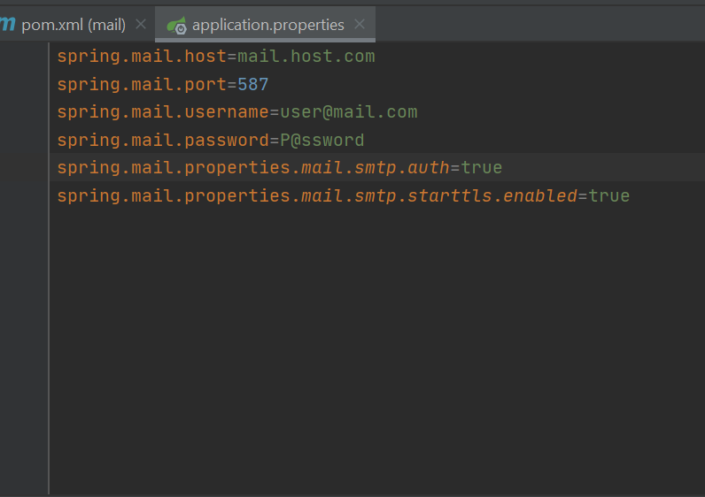
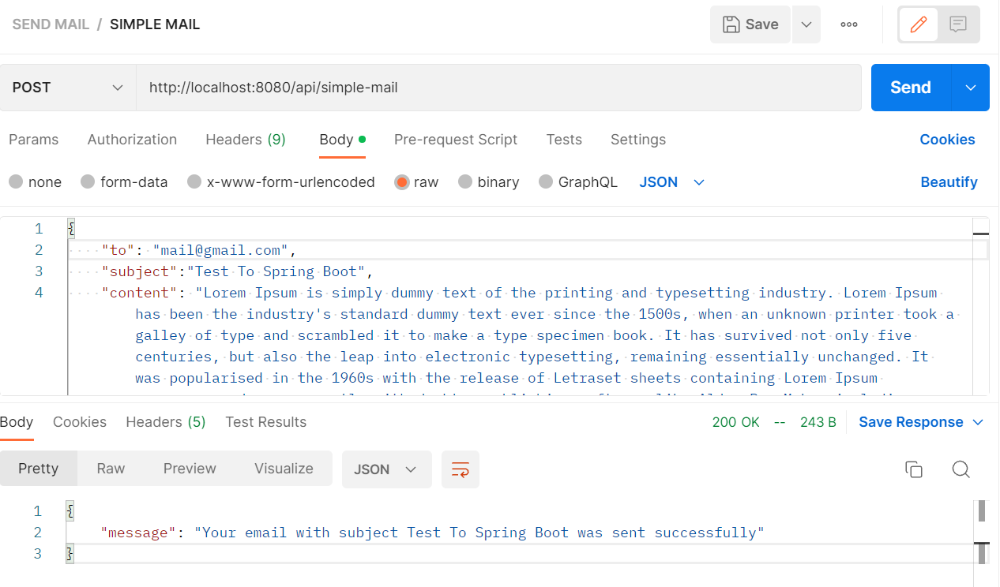

# Implementation of Mail Microservice

### Configuration
###### Go to the applications.properties an configure the SMTP server

###### If you want to use Gmail you can generate a password of application like in image (source : GeeksforGeeks)
.png)

### Send
###### Send an simple mail

